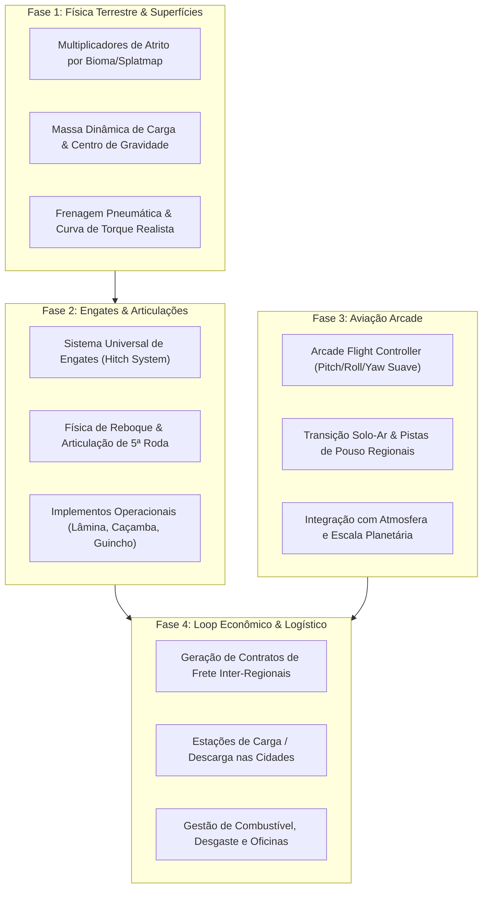

# Roadmap & TODO List: Híbrido Farming Sim + ETS + Voo Arcade

Documento de planejamento e tarefas para integrar os três pilares centrais de jogabilidade no **Project Terra**:
1. **Trabalho e Solo (Farming Simulator):** Ferramentas, deformação/atrito de solo e modularidade.
2. **Logística e Condução Pesada (Euro Truck Simulator 2):** Inércia de carga, articulação de carretas e rotas regionais.
3. **Aviação Utilitária Arcade:** Voo rápido, scouting planetário e frete leve ágil.

---

---

## 📋 Backlog Detalhado de Tarefas

### Fase 1: Física de Terreno e Dinâmica de Pesados (Farming + ETS Core)
*Objetivo: Dar aos veículos a sensação de peso, tração dependente do solo e resistência mecânica.*

- [ ] **1.1. Atrito Dinâmico por Tipo de Superfície (`VehicleController.Physics.cs`)**
  - [ ] Mapear o splatmap/textura ativa do terreno no ponto de contato das rodas.
  - [ ] Definir coeficientes de atrito (Asfalto: `1.0`, Terra batida: `0.75`, Cascalho/Rocha: `0.6`, Lama/Areia: `0.35`).
  - [ ] Implementar perda de tração e derrapagem se o veículo entrar em alta velocidade em solo solto.
- [ ] **1.2. Massa Dinâmica e Deslocamento de Centro de Massa (CoM)**
  - [ ] Permitir que cargas adicionadas à caçamba ou reboque aumentem o `Rigidbody.mass` em tempo real.
  - [ ] Calcular novo `centerOfMass` dinamicamente para aumentar o risco de capotamento em manobras bruscas.
- [ ] **1.3. Simulação de Transmissão e Frenagem**
  - [ ] Curva de torque escalonada para subidas íngremes (reduzida / marcha baixa para superar ladeiras com carga).
  - [ ] Distância de frenagem proporcional à tonelagem total (veículo + carga).
  - [ ] Simulação sonora/mecânica de alívio de pressão de freio de ar ao parar caminhões pesados.

---

### Fase 2: Sistema de Engates, Carretas e Implementos (Hitch System)
*Objetivo: Permitir que veículos terrestres atuem como tratores, caminhões de transporte ou veículos industriais modulares.*

- [ ] **2.1. Arquitetura Universal de Conexão (`HitchPoint`)**
  - [ ] Criar tipos de conectores: `BallHitch` (reboque leve), `FifthWheel` (carreta pesada), `ThreePoint` (implementos agrícolas).
  - [ ] Suporte a engate/desengate dinâmico com tecla de ação (ex: tecla `T`) com snap de alinhamento visual e físico.
- [ ] **2.2. Física de Articulação de Carretas**
  - [ ] Implementar articulação estável via `ConfigurableJoint` com limites angulares realistas para evitar o colapso físico de física rápida do PhysX.
  - [ ] Comportamento de manobra de ré com resposta física fiel (desafio de estacionamento).
- [ ] **2.3. Implementos Funcionais Básicos**
  - [ ] Caçamba basculante para descarregar materiais em depósitos.
  - [ ] Prancha de transporte para carregar outros veículos ou maquinário pequeno.

---

### Fase 3: Controlador de Aviação Arcade
*Objetivo: Oferecer uma forma rápida, prazerosa e sem atritos burocráticos de voar sobre o planeta.*

- [ ] **3.1. `ArcadeAirplaneController.cs`**
  - [ ] Movimentação responsiva com teclas simples (W/S arfagem, A/D rolagem, Q/E leme, Shift aceleração).
  - [ ] Auto-estabilização angular: ao soltar as teclas de rotação, o avião se estabiliza suavemente no horizonte local.
  - [ ] Sustentação física baseada na velocidade frontal (`forwardSpeed * liftCoefficient`), evitando stall frustrante.
- [ ] **3.2. Câmera de Voo Dinâmica**
  - [ ] Câmera em 3ª pessoa com FOV dinâmico baseado na velocidade e atraso elástico suave de curvas (*camera lag*).
- [ ] **3.3. Pouso e Decolagem Acessíveis**
  - [ ] Resistência de trem de pouso simplificada para permitir pousos em pistas de terra, estradas ou clareiras sem destruição instantânea do veículo.

---

### Fase 4: Economia, Contratos de Logística e Cidades
*Objetivo: Integrar as cidades e estradas existentes em um loop viciante de entrega e expansão.*

- [ ] **4.1. Sistema de Missões e Fretes (`FreightContractManager`)**
  - [ ] Gerador de contratos inter-regionais ligando nós de cidades (`RegionCitiesDatabase` e `RegionRoadsDatabase`).
  - [ ] Tipos de frete:
    - *Pesado / Rodoviário:* Maquinário, combustível, materiais de construção (grande remuneração, ritmo calmo).
    - *Granel / Agrícola:* Grãos, madeira, minérios coletados no campo.
    - *Expresso / Aéreo:* Suprimentos médicos ou peças urgentes para serem transportadas de avião.
- [ ] **4.2. Zonas de Carga e Entrega**
  - [ ] Marcação de baías de estacionamento e áreas de carga nas cidades e fazendas.
  - [ ] Bonificação por estacionamento manual correto de carretas (estilo ETS2).
- [ ] **4.3. Consumo, Abastecimento e Economia**
  - [ ] Tanque de combustível para veículos terrestres e aéreos.
  - [ ] Postos de combustível distribuídos ao longo das rodovias principais.

---

### Fase 5: Imersão Tátil, Áudio e Feedback Visual
*Objetivo: Fazer o jogador sentir o motor e a poeira da estrada.*

- [ ] **5.1. Efeitos Visuais de Superfície (VFX Graph / HDRP)**
  - [ ] Poeira contínua nas rodas em estradas de terra.
  - [ ] Spray de água e reflexos úmidos no asfalto em dias de chuva.
  - [ ] Rastro de calor e fumaça de escapamento sob carga de aceleração pesada.
- [ ] **5.2. Áudio Físico Adaptativo**
  - [ ] Pitch e volume do motor modulados por RPM e carga do motor (subidas pesadas aumentam o tom grave do escapamento).
  - [ ] Sons de estalos na suspensão e cascalho batendo no para-lama.
